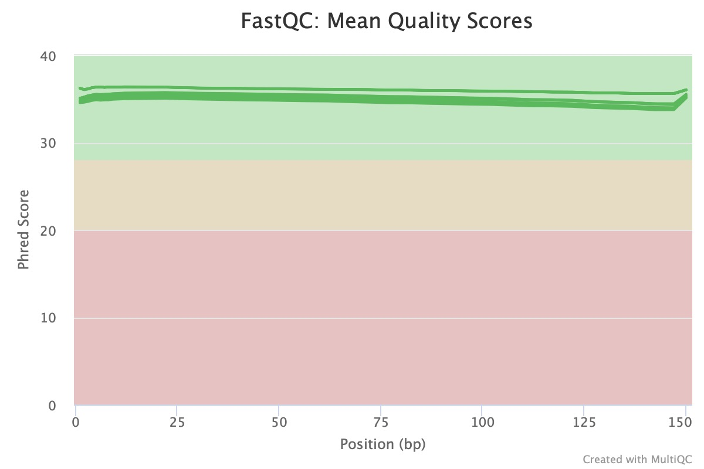
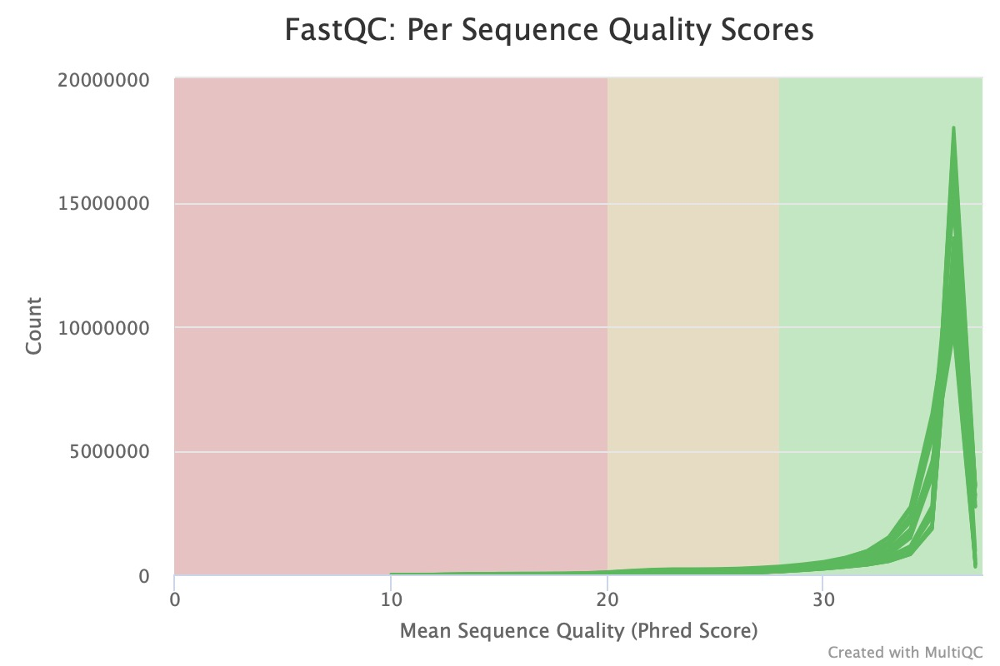
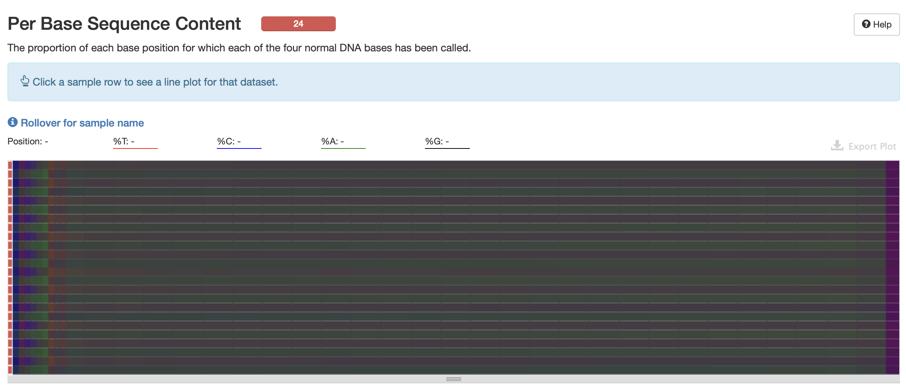
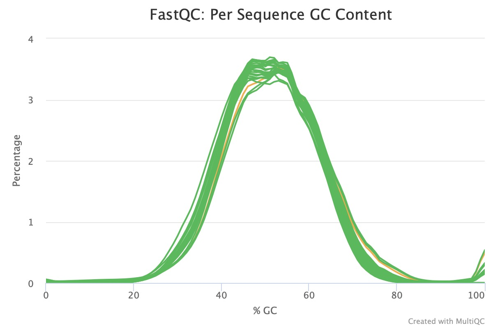
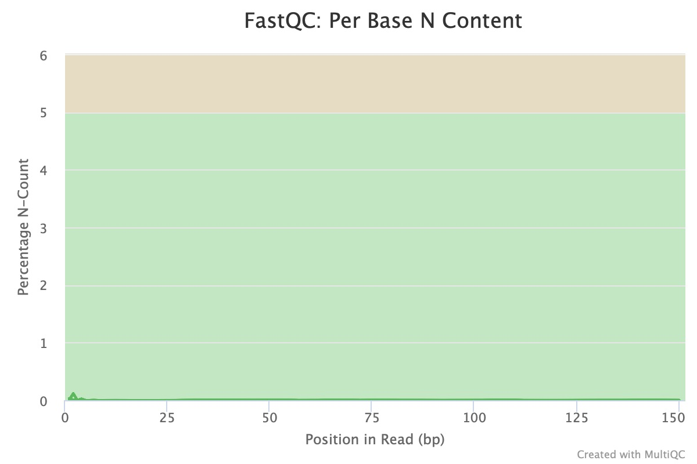
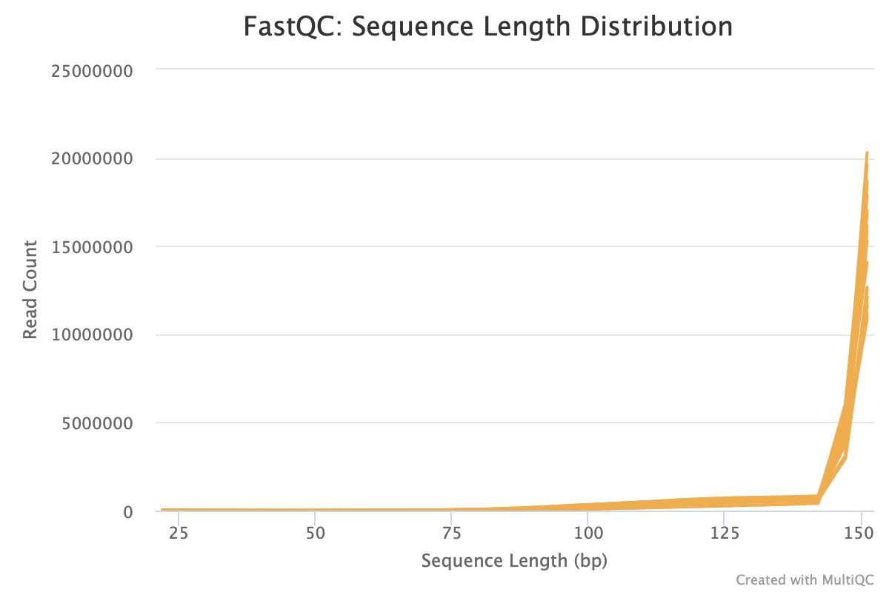

## Table of Contents

* [Basic Statistics](#Basic-Statistics)
* [Per Base Sequence Quality](#Per-Base-Sequence-Quality)
* [Per Tile Sequence Quality](#Per-Tile-Sequence-Quality)
* [Per Sequence Quality Scores](#Per-Sequence-Quality-Scores)
* [Per Base Sequence Content](#Per-Base-Sequence-Content)
* [Per Sequence GC Content](#Per-Sequence-GC-Content)
* [Per Base N Content](#Per-Base-N-Content)
* [Sequence Length Distribution](#Sequence-Length-Distribution)
* [Sequence Duplication Levels](#Sequence-Duplication-Levels)
* [Overrepresented Sequences](#Overrepresented-Sequences)
* [Adapter Content](#Adapter-Content)

## Basic Statistics
- High-quality single-cell/bulk RNA-seq data typically exhibit minimal instances of low-quality sequences and frequently have consistent sequence lengths. 
- The GC content should closely align with the overall GC composition of the genome or transcriptome specific to the species being sequenced. 

## Per Base Sequence Quality
- The horizontal axis denotes the read positions, while the vertical axis displays the quality scores. 
- High-quality single-cell/bulk data: all the yellow boxes which represent the inter-quantile range of position quality scores, should align with the green region. Likewise, the whiskers which represent the 10th and 90th percentiles of the distribution, should also fall within the green area.
- The quality scores tend to decrease as we move along the body of the reads, causing certain base calls at the last positions to enter the orange region (indicating reasonably good quality calls). This drop in quality is often due to the common reduction in the signal-to-noise ratio in most sequencing-by-synthesis methods. Nevertheless, it's important that the **boxes remain outside the red area** (representing calls of poor quality).
- If we observe the poor quality calls, we may consider performing the quality trimming of reads.

  

## Per Tile Sequence Quality
The per tile sequence quality plot indicates the variation in read quality across each sequenced tile in the flowcell. Hotter colors represent greater deviations in quality. Ideally, the plot should display uniform blue, indicating consistent quality across all tiles. However, if some tiles show poor quality (indicated by Hotter  colors), it may suggest temporary issues during sequencing, like bubbles or smudges in the flowcell.

## Per Sequence Quality Scores
The per sequence quality score plot displays each read's average quality score distribution in the file. The x-axis represents average quality scores, while the y-axis indicates the occurrence frequency of each score. Ideally, this plot should exhibit a single peak towards the end, signifying good data quality. The emergence of additional peaks may suggest quality issues in a subset of the reads.

  

## Per Base Sequence Content
The per base sequence content plot displays the percentage distribution of each nucleotide at every base position across all reads in the file. In single-cell data, variations often occur at the beginning of reads due to the non-random nature of priming site sequences. Such fluctuations are common in RNA-seq libraries and may lead to warnings or failures in FastQC, despite being a frequent occurrence.

  

## Per Sequence GC Content
The per sequence GC content plot displays the actual GC content distribution of all reads in red, alongside a theoretical expected distribution in blue. Typically, the observed distribution's main peak should align with the transcriptome's overall GC content. Deviations in the width of the observed distribution from the theoretical one, which is expected to follow the genome's distribution, are not unusual. This can occur because the transcriptome's GC content might differ from the genome's. Although such discrepancies might trigger warnings or failures, they are generally not concerning. However, a complex or highly varied distribution often suggests library contamination. It's important to note that interpreting GC content plots in transcriptomics is challenging. This is because the expected distribution depends on both the transcriptome's sequence content and the unknown gene expression levels in the sample.

  

## Per Base N Content
The plot displaying per base N content illustrates the percentage of bases at each position where an N is identified, typically due to the sequencer's lack of confidence in making a base call. Ideally, in a high-quality library, there should be minimal to zero N content across the entire line.

  

## Sequence Length Distribution
The graph displaying sequence length distribution illustrates the variation in read lengths. Typically in single-cell/bulk chemistry methods, reads are of uniform length. However, if trimming occurred prior to quality assessment, this might introduce slight differences in read lengths.

  

## Sequence Duplication Levels
The sequence duplication level chart shows the distribution of duplication rates in read sequences (indicated by the blue line) before and after deduplication. Due to the necessity of multiple PCR rounds in most single-cell platforms and the tendency of highly expressed genes to produce numerous transcripts, it's common for a small group of sequences to show high duplication levels. Although FastQC does not recognize UMI and might flag this as a warning or failure, it isn't always indicative of poor data quality. However, it's expected that most sequences will display low levels of duplication.

## Overrepresented Sequences
The module identifying overrepresented sequences highlights any reads that constitute a significant portion of the total number of sequences (> 0.1%). While overrepresentation might occur due to highly expressed genes post-PCR amplification, it's generally expected that most sequences won't be overrepresented. It's important to note that if the source of these overrepresented sequences is identified as something other than 'No Hit', this could suggest contamination of the library by that specific source type.

## Adapter Content
The adapter content module displays the cumulative percentage of reads with adapter sequences at each base position. Ideally, these adapter sequences should not be prevalent in the data.

## Further reading
- [Common next-generation sequencing problems](https://sequencing.qcfail.com)
- [FastQC Tutorial & FAQ](https://rtsf.natsci.msu.edu/genomics/technical-documents/fastqc-tutorial-and-faq.aspx)
